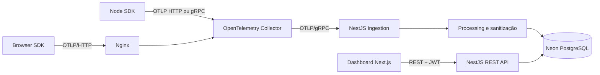

# TCC Observability

Plataforma SaaS de observabilidade para aplicações web, desenvolvida como parte de um Trabalho de Conclusão de Curso em Ciência da Computação. O projeto usa OpenTelemetry como padrão de instrumentação e prioriza tracing no MVP.

## Objetivo

Permitir que uma pessoa desenvolvedora responda onde uma aplicação apresenta erros e em qual parte de uma operação o tempo foi gasto. A plataforma receberá traces de aplicações browser e Node.js, correlacionará serviços e mostrará latência, percentis, erros, operações e waterfalls de spans.

## Estado atual

A fundação, a camada administrativa e a ingestão de traces do MVP estão implementadas:

- dashboard Next.js;
- API NestJS com health check testado;
- persistência exclusivamente no Neon PostgreSQL;
- OpenTelemetry Collector recebendo OTLP HTTP/gRPC e exportando traces para a ingestão interna;
- Nginx como entrada única;
- configurações compartilhadas de TypeScript, ESLint e Prettier;
- schema Prisma completo e migration inicial;
- autenticação JWT com cookies HttpOnly e refresh token rotativo;
- cadastro e login de usuários;
- projetos, environments e Project Keys protegidas por HMAC;
- criação, listagem, rotação e revogação segura de credenciais;
- serviço OTLP/gRPC oficial na porta interna `4319`;
- autenticação de ingestão por Project Key preservada durante o batching;
- sanitização, controle de cardinalidade e normalização de operações;
- descoberta de services e persistência idempotente de traces/spans.
- SDK Node com exporter OTLP/HTTP, auto-instrumentação e spans manuais;
- aplicação Next.js demonstrativa com cenários rápido, lento, erro, banco e pedido composto.

As telas de consulta e waterfall de tracing são a próxima etapa funcional. Metrics e logs continuam no exporter `debug` e não são persistidos neste MVP.

## Arquitetura



Consulte [docs/architecture.md](docs/architecture.md) e [docs/telemetry-flow.md](docs/telemetry-flow.md) para as decisões detalhadas.

## Tecnologias

- pnpm Workspaces e TypeScript;
- Next.js 16, React 19, Tailwind CSS 4, Lucide e Recharts;
- NestJS 12 e REST;
- Prisma 7 e PostgreSQL/Neon;
- OpenTelemetry SDKs, OTLP e OpenTelemetry Collector;
- Jest e Supertest;
- Docker Compose e Nginx.

## Requisitos

- Node.js 22.12 ou superior;
- pnpm 11 ou superior;
- uma conta e bancos no Neon PostgreSQL;
- Docker com Compose para executar aplicações, Collector e Nginx em containers.

## Instalação local

```bash
cp .env.example .env
# Preencha DATABASE_URL, DATABASE_URL_UNPOOLED e DEMO_DATABASE_URL com as conexões do Neon.
pnpm install
pnpm db:migrate:deploy
pnpm dev
```

Serviços durante o desenvolvimento sem Docker:

- dashboard: `http://localhost:3000`;
- API: `http://localhost:4000/api/health`.
- aplicação demonstrativa: `http://localhost:3100`.

## Docker

```bash
cp .env.example .env
# Preencha as três URLs do Neon antes de iniciar.
docker compose up --build
```

O serviço `migrate` aplica as migrations antes de liberar a API.

Entradas expostas:

- plataforma via Nginx: `http://localhost`;
- aplicação demonstrativa: `http://localhost:3100`;
- OTLP/gRPC: `localhost:4317`;
- OTLP/HTTP: `http://localhost:4318` ou `http://localhost/v1/traces`;
- health do Collector: `http://localhost:13133`.

O Compose não executa PostgreSQL local. A plataforma usa exclusivamente Neon: `DATABASE_URL` deve ser a conexão pooled do runtime e `DATABASE_URL_UNPOOLED`, a conexão direta usada pelas migrations. A demonstração usa `DEMO_DATABASE_URL`, preferencialmente de um banco Neon separado.

## Variáveis de ambiente

| Variável                 | Finalidade                                           |
| ------------------------ | ---------------------------------------------------- |
| `API_PORT`               | Porta HTTP da API NestJS                             |
| `INGESTION_GRPC_PORT`    | Porta OTLP/gRPC interna da ingestão                  |
| `API_URL`                | URL interna da API usada pelo Next.js                |
| `NEXT_PUBLIC_API_URL`    | Base pública das chamadas do dashboard               |
| `DATABASE_URL`           | Conexão PostgreSQL de runtime                        |
| `DATABASE_URL_UNPOOLED`  | Conexão direta do Neon para migrations/administração |
| `JWT_SECRET`             | Assinatura de tokens de usuário                      |
| `JWT_ACCESS_TTL_SECONDS` | Duração do access token                              |
| `JWT_REFRESH_TTL_DAYS`   | Duração da sessão renovável                          |
| `PROJECT_KEY_PEPPER`     | Derivação segura dos hashes de Project Keys          |
| `TRACE_RETENTION_DAYS`   | Retenção padrão de traces                            |
| `DEMO_OBS_PROJECT_KEY`   | Project Key privada usada somente no servidor demo   |
| `DEMO_OBS_ENVIRONMENT`   | Environment emitido pelo serviço demonstrativo       |
| `DEMO_OBS_SERVICE_NAME`  | `service.name` do serviço demonstrativo              |
| `DEMO_DATABASE_URL`      | Conexão pooled do banco Neon exclusivo da demo       |

As URLs contêm credenciais e devem permanecer apenas no `.env` local ou no gerenciador de segredos do ambiente hospedado. Nunca faça commit delas.

## OpenTelemetry Collector

A configuração fica em `infrastructure/otel-collector/config.yaml`. Os três pipelines estão declarados para preservar a evolução arquitetural, mas tracing é o único sinal persistido. Metrics e logs permanecem no exporter de diagnóstico.

O pipeline definitivo de traces será:

```text
OTLP receiver → memory limiter → batch por Project Key → NestJS Ingestion → sanitização → PostgreSQL
```

Aplicações server-side enviam a credencial no metadata/header `x-obs-project-key`. O receiver usa `include_metadata`, o batch separa lotes por esse metadata e a extensão `headers_setter` o encaminha ao serviço interno. A Project Key nunca entra nos atributos dos spans.

## Instrumentação Node.js

```ts
import { initObservability } from '@tcc-observability/node';

initObservability({
  projectKey: process.env.OBS_PROJECT_KEY!,
  serviceName: 'envcove-server',
  environment: 'production',
  endpoint: process.env.OTEL_EXPORTER_OTLP_TRACES_ENDPOINT,
});
```

No Next.js, coloque a chamada em `src/instrumentation-node.ts` e carregue esse módulo a partir do hook `register` de `src/instrumentation.ts` apenas quando `NEXT_RUNTIME === 'nodejs'`. A inicialização precisa ocorrer antes das bibliotecas que serão auto-instrumentadas. O SDK ativa instrumentações compatíveis para HTTP, fetch/Undici, frameworks e PostgreSQL, sem capturar headers, parâmetros SQL ou valores de conexão.

Para operações de domínio relevantes, use `traceOperation`:

```ts
import { traceOperation } from '@tcc-observability/node/trace-operation';

const result = await traceOperation('order.process', async () => {
  return processOrder();
});
```

Consulte [packages/node/README.md](packages/node/README.md) para a API e [apps/demo/README.md](apps/demo/README.md) para executar a demonstração.

## Instrumentação browser planejada

```ts
import { initObservability } from '@tcc-observability/browser';

initObservability({
  projectId: 'obs_pub_public_identifier',
  serviceName: 'envcove-browser',
  environment: 'production',
});
```

O identificador browser será público e separado da Project Key privada.

## Estrutura

```text
apps/api                  API e ingestão NestJS
apps/web                  Dashboard Next.js
apps/demo                 Aplicação Next.js instrumentada de demonstração
packages/node             SDK Node.js implementado
packages/browser          SDK browser, em prioridade 2
packages/shared           Tipos e schemas compartilhados
packages/database         Prisma e acesso ao banco
infrastructure            Collector e Nginx
docs                      Documentação acadêmica e técnica
```

## Comandos

```bash
pnpm dev
pnpm lint
pnpm typecheck
pnpm test
pnpm build
pnpm format:check
pnpm db:validate
pnpm db:generate
pnpm db:migrate:dev
pnpm db:migrate:deploy
```

## API administrativa

```text
POST   /api/auth/register
POST   /api/auth/login
POST   /api/auth/refresh
POST   /api/auth/logout
GET    /api/auth/me

POST   /api/projects
GET    /api/projects
GET    /api/projects/:projectId
GET    /api/projects/:projectId/keys
POST   /api/projects/:projectId/keys
DELETE /api/projects/:projectId/keys/:keyId

GET    /api/projects/:projectId/environments
POST   /api/projects/:projectId/environments
```

Ao criar um projeto, a Project Key completa aparece uma única vez. As consultas posteriores retornam somente o prefixo.

## Testes

O projeto utiliza Jest e Supertest. Cada etapa só avança após lint, typecheck, testes e build. Há testes do health check, criptografia, senha, sanitização, transformação OTLP, configuração do SDK e rotas essenciais da demonstração. O teste integrado com banco depende de um branch Neon de teste; o teste do Collector em containers depende de Docker. Os testes unitários não substituem o fluxo de produção.

## Documentação

- [Arquitetura](docs/architecture.md)
- [Banco de dados](docs/database.md)
- [Fluxo de telemetria](docs/telemetry-flow.md)
- [Instrumentação](docs/instrumentation.md)
- [Segurança](docs/security.md)
